# SecureAI

> Every time an AI agent writes code, someone has to trust it. SecureAI makes that trust verifiable.

SecureAI is a high-security sandbox middleware designed to bridge the gap between untrusted LLM-generated code and sensitive enterprise infrastructure. It provides a robust "Safety Layer" that allows AI agents to execute code with granular permissions, human-in-the-loop approvals, and immutable audit trails.

---

### 🌐 [Live App](https://secureai-platform.vercel.app) | 📡 [API Endpoints](https://secureai-production-bf5b.up.railway.app) | 📚 [Docs](API_SPEC.md)


---

## 🎯 Current Status: v1.0.0-beta
✅ **Core Features Fully Implemented:**
- **Sandbox Engine:** Multi-layered isolation using hard-limited Dockerized containers.
- **Permission Engine:** **Structural AST Analysis** (Deterministic parsing) for Python and Node.js.
- **Persistent Database:** **Vercel/Neon PostgreSQL** backend for production-grade reliability across cold starts.
- **Audit Logger:** Cryptographically signed hash chain stored in Postgres for tamper-proof forensics.
- **RBAC Authentication:** API Key + Bearer token authentication with Role-Based Access Control.
- **Waitlist & Lead Capture:** Fully integrated GTM funnel with Postgres persistence and confirmation emails.
- **TypeScript SDK:** Ready-to-use client library for seamless integration.

---

## 🏗️ Core Architecture



### 1. Permission Engine (Policy Enforcement)
Analyzes code before execution to identify required capabilities.
- **Static Analysis:** Detects file access, network egress, subprocesses, and env vars.
- **Threat Detection:** Automatically blocks critical threats (e.g., `rm -rf /`).
- **HITL Approvals:** Triggers human-in-the-loop flows for sensitive requests.

### 2. Sandbox Engine (Process Isolation)
Executes code in a resilient 3-tier isolated environment.
- **Tier 1 (Docker):** Runs code inside hardened Docker containers.
- **Tier 2 (Process Isolation):** Uses secure cross-platform `child_process` execution if Docker is unavailable.
- **Tier 3 (Strict Fallback):** Explicitly blocks execution and throws if no secure runtime exists (no unlogged "mock" fallbacks).
- **Resource Limits:** Strict CPU/RAM caps to prevent resource exhaustion attacks.

### 3. Audit Logger (Immutable Forensics)
Maintains a tamper-proof record of every AI action.
- **Hash Chaining:** Blockchain-style integrity verification for all logs.
- **HMAC Signing:** All entries signed with a secure server-side key.

---

## 🚀 Getting Started

### 1. Installation
```bash
npm install --no-bin-links
npm run build
```

### 2. Configuration
Copy the `.env.example` to `.env` and fill in your keys:
```bash
cp .env.example .env
```

### 3. Setup Test Data
Run the auth test script to create a test user and admin API key:
```bash
npx ts-node test-auth.ts
```

### 4. Running the Server
```bash
node dist/src/index.js
```

### 🧪 Testing
Run the comprehensive test suite (requires Jest setup):
```bash
npm test
```

---

## 🔌 Connecting an AI Agent via MCP

SecureAI includes a native **Model Context Protocol (MCP) Server**. This allows MCP-compatible agents (like Claude Code, Cursor, or your custom agents) to securely sandbox generated code without any custom API integration.

Add this entry to your agent's `mcp.json` or `claude.json` configuration file:

```json
{
  "mcpServers": {
    "secureai": {
      "command": "npx",
      "args": ["ts-node", "src/cli/mcp.ts"],
      "env": {
        "SECUREAI_API_KEY": "YOUR_API_KEY"
      }
    }
  }
}
```

---

## 📡 API Usage Example

Integrate SecureAI into your AI agent's workflow using a simple REST request:

```javascript
const API_URL = "https://secureai-production-bf5b.up.railway.app/v1/execute";

const response = await fetch(API_URL, {
  method: "POST",
  headers: {
    "Content-Type": "application/json",
    "Authorization": "Bearer YOUR_API_KEY" 
  },
  body: JSON.stringify({
    language: "python",
    code: "print('Hello from SecureAI and my live backend!')"
  })
});

const data = await response.json();
console.log(data);
```

---

## 🗺️ Roadmap
- [x] Core Architecture & MVP Prototype
- [x] Immutable Audit Logging (Signed Hash Chain)
- [x] Production PostgreSQL & RBAC Authentication
- [x] Deterministic Structural AST Scanning (Vulnerability resistant)
- [x] Integrated GTM Funnel & Waitlist Dashboard
- [ ] Slack & Microsoft Teams Approval Integration
- [ ] Production eBPF Isolation
- [ ] SOC2 / HIPAA Compliance Certification

## 🤝 Contributing
Want to contribute? See [CONTRIBUTING.md](CONTRIBUTING.md).

## ⚖️ License
MIT License. See [LICENSE](LICENSE) for details.

---
**SecureAI** — *Deploying AI Agents with Confidence.*
